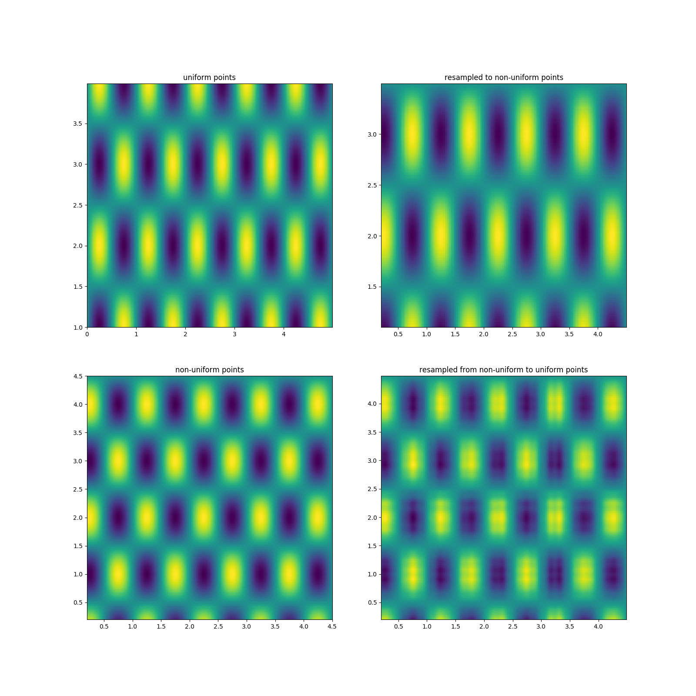

# Interpolating signals using the sinc-interpolation formula

A continuous signal, $s_c$, is sampled at discrete points $x_n$, so that
$s[x_n]$ is the sample values. To re-construct the continuous signal from the
discrete samples the discrete values are convolved with the $sinc$-function
[@Shannon1948; @Oppenheim2014]:

$$ s(x) = \sum \limits^N_{i=1} s[x_i] \cdot sinc\left(\frac{x - x_i}{T}\right) $$ {#eq:sinc-recon}

where $T$ is the sampling-interval (inverse of frequency) so that $x_n = nT$.
This is known as the _Nyquist-Shannon_-interpolation formula. When the sample
rate is sufficiently high, satisfying the Nyquist-criterion of at least two
times the highest frequency in the signal, the signal can be perfectly
reconstructed. This stems from bandpassing the sampled signal. The perfect
bandpass filter is a rectangle in the frequency-domain, the Fourier-transform
of a rectangle is a $sinc$-function.

Here $sinc$ is the normalized sinc-function:

$$ sinc(x) = \frac{sin(\pi x)}{\pi x} $$ {#eq:sinc}

and

$$ sinc^2(x) = \left( \frac{sin(\pi x)}{\pi x} \right)^2 $$ {#eq:sinc2}

in higher dimensions:

$$ sinc(\mathbf{x}) = sinc(x_1) \cdot sinc(x_2) \cdot ... $$ {#eq:sinc-nd}

## The fast sinc transform

The Fourier transform of the $sinc$-function is the $\Pi$-function (rectangle).
The Fourier-transform of the $sinc^2$-function is the $\Lambda$-function (triangle).

The $sinc$-transform is defined as:

$$ Um = \sum \limits^N_{n=1} q_n sinc (\mathbf{k}_n - \mathbf{v}_m) $$ {#eq:sinc-transform}

The (discrete) convolution in @eq:sinc-transform can be performed quickly
using the _NUFFT_ library since the convolution in $x$ equals a multiplication
in the $k$-domain, from [@Greengard2006 section 2.]:

1. Weight $s[x]$ according to sample spacing using e.g. the Sinc-3 scheme.
2. Take forward Fourier transform of $s[x]$ to quadrature nodes (e.g. Gauss-Legendre), to get
   $S[k]$ (re-projecting $k_x$ to $[-1, 1]$).
3. The weights do not need to be scaled since the $sinc$-function is $1$ for the frequency-band.
4. Integrate $S[k]$ from $[-1, 1]$ numerically.
5. Take inverse Fourier transform of $\int S[k]$

## The Fourier transform on non-uniform samples

The approximate (inverse or _adjoint_) Fourier transform [@Greengard2006]:

$$ \rho(\mathbf{r}_m) \approx \sum\limits_{n=1}^{N} s(n) e^{-2 \pi i \mathbf{k}(n) \cdot \mathbf{r}_m} \cdot w_n $$ {#eq:approx-dft}

The non-uniform fast Fourier transform [@Barnett2019], NUFFT, type 3 (most general) computes sums of type:

The forward transform:

$$ G_j = \sum \limits^P_{p=1} g_p e^{-i \mathbf{k}_j \cdot \mathbf{x}_p} $$ {#eq:nufft-3-fwd}

or, the inverse (adjoint) transform:

$$ g_p = \sum \limits^J_{j=1} G_j e^{+i \mathbf{k}_j \cdot \mathbf{x}_p} $$ {#eq:nufft-3-inv}

## Sinc-kernel weights

Optimal weights (Sinc-3 in [@Choi1998; @Inati2005]):

$$ \frac{1}{w_n} = \sum\limits^{N}_{m=1} sinc^2(\mathbf{k}(m) - \mathbf{k}(n)) $$ {#eq:optimal-weights}

These can be calculated quickly in a similar way as the sinc-transform
(@eq:sinc-transform). The only difference is that the quadrature weights are
scaled with the triangle function ($\Lambda$).

## Jacobian weights

Another choice weights is the difference between samples, Jacobian-weighting,
see Sinc-2 in [@Choi1998], so that densely sampled regions are scaled down
proportionally. For a single-variable scalar function $f(x')$:

$$ \mathbf J = \frac{\partial x'}{\partial x_{uf}} $$

where $x'$ is the non-uniform samples and $x_{uf}$ is an equidistant
monotonically increasing grid.

$$ w_n = x_{n+1} - x_n $$

up to $n = N - 1$, and $w_N = w_{N-1}$.

This is easy to approximate for 1D using the differences of the sorted sample
points, but trickier to approximate for two or more dimensions.

## Gauss-Legendre quadrature

Weights are found for nodes on interval $[-1, 1]$ (re-scale input to this
interval), multiply by weights to numerically integrate. This is exact for a
polynominal with degree less or equal to $2n -1$, where $n$ is number of nodes.

$$ \int_{-1}^1 f(x) \approx \sum \limits^{n}_{i=0} w_i \cdot f(x_i) $$

## The interpolation

Use the fast sinc transform in @eq:sinc-transform to evaluate the
sinc-interpolation equation in @eq:sinc-recon. The input samples can be
weighted using the optimal weights (@eq:optimal-weights), which is also
calculated using the NUFFT.

# References
